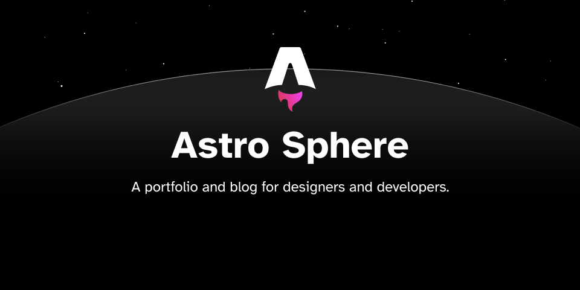

## Info 
This is the github for my personal website. It uses Astro to build a static site.
## 💻 Commands

All commands are run from the root of the project, from a terminal:

Replace npm with your package manager of choice. `npm`, `pnpm`, `yarn`, `bun`, etc

| Command                   | Action                                           |
| :------------------------ | :----------------------------------------------- |
| `npm install`             | Installs dependencies                            |
| `npm run dev`             | Starts local dev server at `localhost:4321`      |
| `npm run dev:network`     | Starts dev server on local network               |
| `npm run sync`            | Generates TypeScript types for all Astro modules.|
| `npm run build`           | Build your production site to `./dist/`          |
| `npm run preview`         | Preview your build locally, before deploying     |
| `npm run preview:network` | Starts preview server on local network           |
| `npm run astro ...`       | Run CLI commands like `astro add`, `astro check` |
| `npm run astro -- --help` | Get help using the Astro CLI                     |
| `npm run lint`            | Run ESLint                                       |
| `npm run lint:fix`        | Auto-fix ESLint issues                           |

## 🏛️ License

MIT

Based on the [Astro Sphere template](https://github.com/markhorn-dev/astro-sphere) by Mark Horn et al.

Astro Sphere is a static, minimalist, lightweight, lightning fast portfolio and blog theme based on my personal website.

It is primarily Astro, Tailwind and Typescript, with a very small amount of SolidJS for stateful components.

